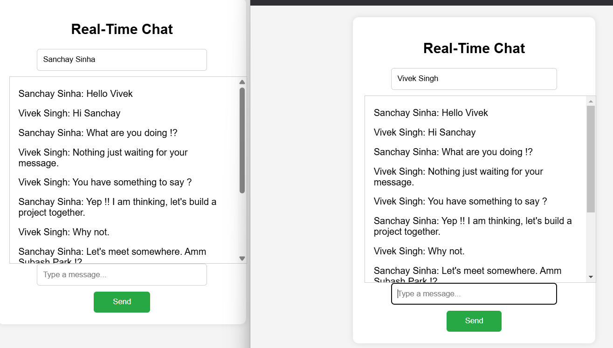

# Real-Time Chat Application

## Description
A real-time chat application built with [Spring Boot] that allows users to communicate instantly. This project demonstrates the implementation of real-time communication using [WebSocket].

## Features
- User authentication and authorization
- Real-time messaging
- Group chats


## Installation
1. Clone the repository:
    ```sh
    git clone https://github.com/sinha-sanchay/Real-Time-Chat-Application.git
    ```
2. Navigate to the project directory:
    ```sh
    cd Real-Time-Chat-Application
    ```
3. Install dependencies:
    ```sh
    npm install
    ```
4. Set up environment variables:
    Create a `.env` file in the root directory and add the necessary environment variables:
    ```plaintext
    DATABASE_URL=your_database_url
    SECRET_KEY=your_secret_key
    ```
5. Start the application:
    ```sh
    npm start
    ```

## Usage
1. Open your web browser and navigate to `http://localhost:3000`.
2. Register a new account or log in with an existing one.
3. Start chatting with other users in real-time.

## Result


## Contributing
Contributions are welcome! Please follow these steps to contribute:
1. Fork the repository.
2. Create a new branch (`git checkout -b feature/YourFeature`).
3. Commit your changes (`git commit -m 'Add some feature'`).
4. Push to the branch (`git push origin feature/YourFeature`).
5. Open a pull request.

## License
This project is licensed under the MIT License - see the [LICENSE](LICENSE) file for details.

## Contact
Created by [Sanchay Sinha](https://github.com/sinha-sanchay) - feel free to contact me!
